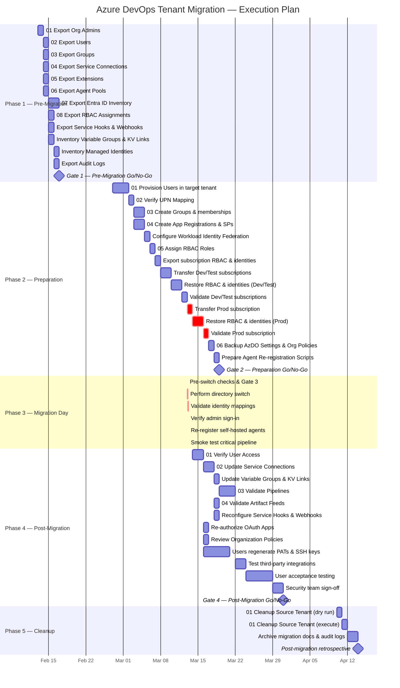

# Azure DevOps Tenant Migration Plan

## Migrating Azure DevOps (Services) Directory from contoso.com to zava.com

---

## Table of Contents

1. [Executive Summary](#1-executive-summary)
2. [Scope and Objectives](#2-scope-and-objectives)
3. [Prerequisites and Third-Party Dependencies](#3-prerequisites-and-third-party-dependencies)
4. [Users and Groups Migration in Microsoft Entra ID](#4-users-and-groups-migration-in-microsoft-entra-id)
5. [Managed Identities and Workload Identity Federation](#5-managed-identities-and-workload-identity-federation)
6. [Azure Subscription Transfer Process](#6-azure-subscription-transfer-process)
7. [Migration Plan — Prioritized Steps](#7-migration-plan--prioritized-steps)
8. [RACI Matrix](#8-raci-matrix)
9. [Go/No-Go Decision Gates](#9-gono-go-decision-gates)
10. [Detailed Migration Steps](#10-detailed-migration-steps)
11. [Leveraging AI Tools (GitHub Copilot) for Migration Automation](#11-leveraging-ai-tools-github-copilot-for-migration-automation)
12. [Migration Checklist](#12-migration-checklist)
13. [Rollback Plan](#13-rollback-plan)
14. [Audit, Compliance, and Governance](#14-audit-compliance-and-governance)
15. [Microsoft Official References](#15-microsoft-official-references)

---

## 1. Executive Summary

This document provides a comprehensive plan for migrating the Azure DevOps Services organization directory from the **contoso.com** Microsoft Entra ID (formerly Azure Active Directory) tenant to the **zava.com** tenant.

Changing the backing directory of an Azure DevOps organization is a significant operation that impacts user identities, permissions, group memberships, service connections, and integrations. Careful planning, stakeholder alignment, and thorough testing are essential to minimize downtime and disruption.

---

## 2. Scope and Objectives

### In Scope

- Migration of the Azure DevOps Services organization directory connection from **contoso.com** to **zava.com** Entra ID tenant.
- Migration and mapping of user identities and group memberships.
- Re-establishment of permissions, access levels, and security configurations.
- Migration of service connections, service principals, and managed identities.
- **Transfer of Azure subscriptions** from contoso.com to zava.com tenant (including RBAC, managed identities, Key Vault, and all dependent resource reconfigurations).
- Update of all third-party integrations and extensions.
- Validation and post-migration testing.

### Out of Scope

- Azure DevOps Server (on-premises) migrations.
- Migration of Azure DevOps data (repos, pipelines, work items) between organizations — data remains in the same organization; only the backing directory changes.
- Migration of Azure resources that are not linked to Azure DevOps (handled by separate infrastructure migration projects).

### Key Decision — Azure Subscription Transfer

> ⚠️ **This decision must be made before Phase 2 begins and directly impacts the migration scope, timeline, and risk profile.**

An Azure DevOps directory switch **does not inherently require** migrating Azure subscriptions. They are independent operations. However, the decision has significant downstream consequences:

| Scenario | Description | Impact on Migration |
|---|---|---|
| **A — Subscriptions move to zava.com** | All Azure subscriptions linked to service connections transfer to the new tenant. | Adds 1–2 weeks of preparation. RBAC, managed identities, Key Vault, AKS, SQL, and other resources must be reconfigured. **This plan assumes Scenario A.** |
| **B — Subscriptions stay in contoso.com** | Azure infrastructure remains under the original tenant. | Simpler migration. Requires cross-tenant service principals (multi-tenant app registrations) or Azure Lighthouse. Adds ongoing operational complexity. |
| **C — Mixed** | Some subscriptions move, others stay. | Both patterns apply simultaneously. Most complex operationally. |

This plan documents the **full process for Scenario A** (subscription transfer) in [Section 6](#6-azure-subscription-transfer-process). If Scenario B or C applies, the subscription transfer steps can be marked as N/A or adapted accordingly.

### Objectives

- Ensure zero data loss during migration.
- Minimize user disruption and downtime.
- Maintain security posture and compliance.
- Document all steps for repeatability and auditability.

---

## 3. Prerequisites and Third-Party Dependencies

### Azure and Microsoft Dependencies

| Dependency | Description | Required |
|---|---|---|
| **Microsoft Entra ID (Azure AD) — Source Tenant** | contoso.com tenant with Global Administrator or Privileged Role Administrator access | ✅ Yes |
| **Microsoft Entra ID (Azure AD) — Target Tenant** | zava.com tenant with Global Administrator or Privileged Role Administrator access | ✅ Yes |
| **Azure DevOps Organization** | Organization Owner or Project Collection Administrator role | ✅ Yes |
| **Azure Subscriptions** | Access to all Azure subscriptions linked to service connections | ✅ Yes |
| **Microsoft 365 Licenses** | Appropriate licensing for users in the target tenant | ✅ Yes |
| **Azure Key Vault** | If secrets/certificates are used by pipelines | ⚠️ Conditional |
| **Azure Container Registry** | If container images are referenced in pipelines | ⚠️ Conditional |
| **Azure Resource Manager (ARM)** | For service connections to Azure resources | ✅ Yes |

### Third-Party Dependencies

| Dependency | Impact | Action Required |
|---|---|---|
| **GitHub integrations** | Service connections, webhooks, and OAuth apps linked to contoso.com identities | Reconfigure with zava.com identities |
| **Slack / Microsoft Teams notifications** | Webhook integrations may reference old identity context | Update notification configurations |
| **SonarQube / SonarCloud** | Service connections and authentication tokens | Regenerate tokens with new identities |
| **Marketplace Extensions** | Extensions installed in the organization may use identity-based permissions | Review and re-authorize extensions |
| **NuGet / npm / Maven feeds** | Upstream sources and feed permissions tied to identities | Update permissions for new identities |
| **Terraform / Ansible / Pulumi** | IaC tools using service principals from contoso.com tenant | Create new service principals in zava.com |
| **External Git repositories** | SSH keys and PATs tied to contoso.com users | Regenerate credentials |
| **SAML/SSO Providers** | If using external SAML SSO with contoso.com | Reconfigure for zava.com |

### Tools Required

- [Azure CLI](https://learn.microsoft.com/en-us/cli/azure/install-azure-cli) (`az` command)
- [Azure DevOps CLI extension](https://learn.microsoft.com/en-us/azure/devops/cli/) (`az devops`)
- [Microsoft Graph PowerShell SDK](https://learn.microsoft.com/en-us/powershell/microsoftgraph/installation)
- [AzureAD / Microsoft.Graph PowerShell modules](https://learn.microsoft.com/en-us/powershell/azure/active-directory/overview)
- [GitHub Copilot](https://github.com/features/copilot) (for AI-assisted scripting)

---

## 4. Users and Groups Migration in Microsoft Entra ID

### Overview

The most critical and complex part of the tenant migration is the identity migration. Every user and group in Azure DevOps is backed by an identity in Microsoft Entra ID. When you switch the organization's backing directory from contoso.com to zava.com, Azure DevOps will attempt to map existing users to identities in the new tenant.

### User Migration Strategy

#### Step 1 — Inventory Existing Users

Before migration, perform a complete inventory of all users in the Azure DevOps organization:

- **List all users** with their Entra ID User Principal Names (UPNs), display names, and access levels (Basic, Stakeholder, Visual Studio Subscriber, etc.).
- **Document access levels** and license assignments.
- **Export group memberships** for all Azure DevOps security groups and teams.
- **Record personal access tokens (PATs)**, SSH keys, and alternate credentials — these will be invalidated after migration and must be regenerated.

Use the Azure DevOps REST API or CLI to export this information:

```bash
az devops user list --organization https://dev.azure.com/{org} --output table
```

#### Step 2 — Provision Users in the Target Tenant (zava.com)

Users must exist in the zava.com Entra ID tenant before the directory switch:

- **Create user accounts** in zava.com with matching attributes (display name, email, etc.).
- **Use Microsoft Entra Connect** (Azure AD Connect) if synchronizing from an on-premises Active Directory to the new tenant.
- **For cloud-only users**, create them directly in the Entra ID portal or via PowerShell/Graph API:

```powershell
# Using Microsoft Graph PowerShell
Connect-MgGraph -Scopes "User.ReadWrite.All"

New-MgUser -DisplayName "John Doe" `
  -UserPrincipalName "john.doe@zava.com" `
  -MailNickname "john.doe" `
  -AccountEnabled `
  -PasswordProfile @{
    ForceChangePasswordNextSignIn = $true
    Password = "TemporaryP@ssw0rd!"
  }
```

- **Ensure UPN mapping** — if a user was `john.doe@contoso.com`, they should be `john.doe@zava.com` in the new tenant. Azure DevOps uses UPN prefix matching during the directory switch.

#### Step 3 — Migrate Groups

Groups in Azure DevOps can be:

- **Azure DevOps-managed groups** (e.g., Project Administrators, Contributors) — these are internal to Azure DevOps and persist after migration, but their members need re-mapping.
- **Entra ID groups** — if you have added Entra ID security groups or Microsoft 365 groups directly to Azure DevOps, you must recreate these groups in the zava.com tenant.

For Entra ID groups:

```powershell
# Export groups from source tenant
Connect-MgGraph -TenantId "contoso.com"
$groups = Get-MgGroup -All | Select-Object DisplayName, Id, Description, GroupTypes

# Create groups in target tenant
Connect-MgGraph -TenantId "zava.com"
foreach ($group in $groups) {
    New-MgGroup -DisplayName $group.DisplayName `
      -Description $group.Description `
      -MailEnabled:$false `
      -SecurityEnabled:$true `
      -MailNickname ($group.DisplayName -replace '\s','')
}
```

#### Step 4 — Map User Identities

Azure DevOps performs identity mapping during the directory switch based on:

1. **UPN match** — The user's UPN in the source tenant matches a UPN in the target tenant (e.g., `john.doe@contoso.com` → `john.doe@zava.com`).
2. **Email match** — If UPN doesn't match, Azure DevOps will try matching by email address.
3. **Display name match** — Last resort matching by display name.

> ⚠️ **Important**: Users that cannot be automatically mapped will lose access to the organization. It is critical to ensure all users have corresponding accounts in the target tenant before performing the switch.

#### Step 5 — Handle Guest Users (B2B)

If your organization includes guest users (B2B) from external tenants:

- Guest users from contoso.com who are accessing Azure DevOps will need to be re-invited as guests in zava.com.
- External guest users from other tenants (e.g., partner@fabrikam.com) will need to be re-invited via zava.com.

```powershell
# Invite guest user to new tenant
New-MgInvitation -InvitedUserEmailAddress "partner@fabrikam.com" `
  -InviteRedirectUrl "https://dev.azure.com/{org}" `
  -SendInvitationMessage:$true
```

#### Step 6 — Validate Identity Mapping

Before the actual switch, use the Azure DevOps identity mapping tool to preview how users will be mapped. This is available during the directory switch process in the Azure DevOps portal and allows you to:

- Review automatic mappings.
- Manually map users that couldn't be automatically matched.
- Identify users who will lose access.

### Entra ID Conditional Access and Security Policies

After migration, review and recreate (if needed) the following in the zava.com tenant:

- **Conditional Access Policies** targeting Azure DevOps.
- **Multi-Factor Authentication (MFA)** requirements.
- **Named Locations** and IP-based restrictions.
- **Terms of Use** policies.
- **Identity Protection** policies.

---

## 5. Managed Identities and Workload Identity Federation

### Managed Identities

Managed identities are bound to the Entra ID tenant and **cannot be migrated** across tenants. They must be handled explicitly:

- **System-assigned managed identities** — These are tied to the lifecycle of an Azure resource and its tenant. If Azure resources remain in the same tenant, they continue to work. If subscriptions are being transferred to zava.com, all system-assigned managed identities are **deleted and must be re-enabled** after the transfer.
- **User-assigned managed identities** — These are standalone Azure resources. Like system-assigned identities, they are deleted during a subscription transfer and must be recreated in the zava.com tenant.

#### Impact on Azure DevOps

- **Pipeline tasks using managed identities** (e.g., `AzureCLI@2` with `addSpnToEnvironment`, or Azure Key Vault tasks) will fail if the managed identity no longer exists or has different object IDs.
- **Self-hosted agents on Azure VMs** that use managed identities to authenticate to Azure resources must have their identities reconfigured.
- **Azure DevOps service connections of type "Managed Identity Authentication"** must be recreated pointing to the new identity.

#### Actions Required

```powershell
# Inventory all user-assigned managed identities in affected subscriptions
Get-AzUserAssignedIdentity | Select-Object Name, ResourceGroupName, PrincipalId, TenantId |
  Export-Csv -Path "managed_identities_inventory.csv" -NoTypeInformation

# After subscription transfer, recreate user-assigned managed identities
# and update all RBAC role assignments
```

### Workload Identity Federation (Recommended for New Service Connections)

Azure DevOps now supports **Workload Identity Federation** (OIDC-based) for service connections to Azure, eliminating the need for client secrets. When recreating service connections in zava.com:

1. **Prefer federated credentials** over client secrets for all new app registrations.
2. Configure the federated credential to trust the Azure DevOps organization's OIDC issuer:
   - Issuer: `https://vstoken.dev.azure.com/{organization-id}`
   - Subject: `sc:///{org}/{project}/{service-connection-name}`
3. No secret rotation is required for federated service connections.

```powershell
# Create federated credential on an app registration
$federatedCredential = @{
    Name      = "AzDevOps-Federation"
    Issuer    = "https://vstoken.dev.azure.com/{organization-id}"
    Subject   = "sc:///{org}/{project}/{service-connection-name}"
    Audiences = @("api://AzureADTokenExchange")
}
New-MgApplicationFederatedIdentityCredential -ApplicationId $app.Id -BodyParameter $federatedCredential
```

> 💡 **Recommendation**: Use this migration as an opportunity to upgrade all service connections from secret-based to Workload Identity Federation. This improves security posture and eliminates secret expiration risks.

---

## 6. Azure Subscription Transfer Process

Transferring Azure subscriptions from contoso.com to zava.com is a **prerequisite** for the Azure DevOps directory switch when pipelines deploy to Azure resources that must be managed under the new tenant. This section provides the complete end-to-end process.

> ⚠️ **Critical**: Transfer subscriptions **before** switching the Azure DevOps organization directory. Service connections referencing these subscriptions will be reconfigured to use zava.com service principals in Phase 4 (post-migration).

### 6.1 Prerequisites for Subscription Transfer

| Prerequisite | Description |
|---|---|
| **Source tenant access** | Global Administrator in contoso.com OR Owner on the subscription |
| **Target tenant access** | Global Administrator in zava.com OR a user with the `Microsoft.Subscription/accept/action` permission |
| **No Azure Prepayment (Enterprise Agreement)** | EA subscriptions require EA enrollment admin action to transfer. Contact your EA admin first. |
| **No active Azure Support plans** | Support plans cannot be transferred and must be cancelled/re-purchased. |
| **No Azure Marketplace purchases** | Some Marketplace resources do not support transfer and may need re-provisioning. |
| **Billing check** | Verify the subscription has no outstanding balance. Azure DevOps billing subscription must remain functioning throughout. |

### 6.2 Impact Assessment — What Breaks During Transfer

When a subscription changes tenant, the following are **immediately affected**:

| Component | Impact | Severity | Recovery Action |
|---|---|---|---|
| **All RBAC role assignments** | **Deleted** — every custom and built-in role assignment on the subscription, resource groups, and resources is removed. | 🔴 Critical | Restore from exported role assignments (pre-migration scripts). |
| **System-assigned managed identities** | **Disabled** — the identity is detached and receives a new principal ID when re-enabled. | 🔴 Critical | Re-enable on each resource; update all references to the new principal ID. |
| **User-assigned managed identities** | **Deleted** — the resource is removed during transfer. | 🔴 Critical | Recreate in the target tenant; reassign to resources; recreate RBAC. |
| **Key Vault access policies** | **Preserved** but reference old tenant object IDs — no longer resolve. | 🔴 Critical | Update each access policy with new object IDs from zava.com. |
| **Key Vault RBAC** | **Deleted** with other role assignments. | 🔴 Critical | Recreate RBAC role assignments for Key Vault data plane access. |
| **Azure SQL Entra ID admin** | Admin references old tenant identity — authentication fails. | 🔴 Critical | Reconfigure Entra ID admin with zava.com identity. |
| **Cosmos DB Entra ID auth** | RBAC assignments deleted; Entra ID-based auth fails. | 🟡 High | Recreate RBAC assignments with new identity object IDs. |
| **Azure Container Registry (ACR)** | RBAC removed; pull/push operations using Entra ID auth fail. | 🟡 High | Recreate RBAC (AcrPull, AcrPush) for service principals and managed identities. |
| **AKS cluster** | Cluster identity and kubelet identity become invalid. Nodepool scaling, pod identity, and Key Vault integration break. | 🔴 Critical | Update cluster identity; rotate credentials; reconfigure pod identity/workload identity. |
| **App Service / Function App** | System-assigned identity disabled; Key Vault references, managed identity-based connections break. | 🟡 High | Re-enable system identity; update Key Vault references; reconfigure auth. |
| **Storage account SAS (Entra ID-based)** | Entra ID-based SAS tokens become invalid. Account keys are unaffected. | 🟡 Medium | Regenerate SAS tokens with new identities or use account keys. |
| **Virtual Network / NSG** | No identity impact. Rules preserved. | 🟢 None | No action required. |
| **DNS zones** | No identity impact. Records preserved. | 🟢 None | No action required. |
| **Azure Monitor / Log Analytics** | RBAC removed; alert action groups referencing identity-based targets may break. | 🟡 Medium | Recreate RBAC; verify alert action groups. |
| **Azure DevOps billing** | If this subscription is used for Azure DevOps billing, billing must remain functional. | 🔴 Critical | Verify billing continues to work after transfer; update billing owner identity. |

### 6.3 Pre-Transfer Inventory and Export

Before transferring any subscription, export everything that will be lost:

```powershell
# --- 1. Export ALL RBAC role assignments for the subscription ---
$subscriptionId = "{subscription-id}"
Get-AzRoleAssignment -Scope "/subscriptions/$subscriptionId" |
  Select-Object DisplayName, SignInName, ObjectId, ObjectType, RoleDefinitionName, Scope |
  Export-Csv -Path "rbac_assignments_$subscriptionId.csv" -NoTypeInformation

# --- 2. Export custom role definitions ---
Get-AzRoleDefinition -Custom -Scope "/subscriptions/$subscriptionId" |
  ConvertTo-Json -Depth 10 | Out-File "custom_roles_$subscriptionId.json"

# --- 3. Export managed identities ---
# System-assigned: list resources with identity enabled
Get-AzResource -ResourceType "Microsoft.ManagedIdentity/userAssignedIdentities" |
  Select-Object Name, ResourceGroupName, Location |
  Export-Csv -Path "user_assigned_mi_$subscriptionId.csv" -NoTypeInformation

# Identify resources with system-assigned identity enabled
Get-AzResource | Where-Object { $_.Identity.Type -match "SystemAssigned" } |
  Select-Object Name, ResourceType, ResourceGroupName, @{N='PrincipalId';E={$_.Identity.PrincipalId}} |
  Export-Csv -Path "system_assigned_mi_$subscriptionId.csv" -NoTypeInformation

# --- 4. Export Key Vault access policies ---
foreach ($vault in (Get-AzKeyVault)) {
    $kv = Get-AzKeyVault -VaultName $vault.VaultName
    $kv.AccessPolicies | Select-Object @{N='VaultName';E={$vault.VaultName}}, ObjectId, Permissions |
      Export-Csv -Path "keyvault_access_$($vault.VaultName).csv" -NoTypeInformation -Append
}

# --- 5. Export Azure SQL Entra ID administrators ---
Get-AzSqlServer | ForEach-Object {
    Get-AzSqlServerActiveDirectoryAdministrator -ServerName $_.ServerName -ResourceGroupName $_.ResourceGroupName
} | Export-Csv -Path "sql_ad_admins_$subscriptionId.csv" -NoTypeInformation

# --- 6. Export AKS cluster identity details ---
Get-AzAksCluster | Select-Object Name, ResourceGroupName,
  @{N='IdentityType';E={$_.Identity.Type}},
  @{N='IdentityPrincipalId';E={$_.Identity.PrincipalId}},
  @{N='KubeletIdentity';E={$_.IdentityProfile.kubeletidentity.ObjectId}} |
  Export-Csv -Path "aks_identities_$subscriptionId.csv" -NoTypeInformation
```

### 6.4 Step-by-Step Subscription Transfer Process

#### Step 1 — Prepare the Source Subscription

1. **Remove resource locks** that would prevent the transfer:
   ```bash
   # List all locks
   az lock list --subscription {subscription-id} --output table
   # Remove if blocking transfer (document them for recreation)
   az lock delete --name {lock-name} --resource-group {rg}
   ```

2. **Cancel or migrate Azure Marketplace resources** that don't support transfer. Check the [Microsoft documentation](https://learn.microsoft.com/en-us/azure/cost-management-billing/manage/transfer-subscriptions-subscribers-csp#azure-marketplace-products-transfer) for unsupported products.

3. **Validate there are no expired or disabled resources** that could block the transfer.

#### Step 2 — Initiate the Transfer from the Azure Portal

1. Sign in to the [Azure portal](https://portal.azure.com) as a **Subscription Owner** or **Global Administrator** on the contoso.com tenant.
2. Navigate to **Subscriptions** → select the subscription → **Change directory**.
3. Select **zava.com** as the target directory.
4. Review the summary of impact (resources that will be affected).
5. Check **"I understand the impact..."** and click **Change**.

> ⚠️ The transfer takes **15–30 minutes** to propagate. During this time the subscription and its resources may be temporarily unavailable.

Alternatively, use Azure CLI:

```bash
# Transfer subscription to new tenant
az account tenant update \
  --tenant-id {zava-com-tenant-id} \
  --subscription {subscription-id}
```

Or via REST API:

```bash
# POST https://management.azure.com/subscriptions/{subscription-id}/providers/Microsoft.Subscription/changeDirectory
curl -X POST \
  "https://management.azure.com/subscriptions/{subscription-id}/providers/Microsoft.Subscription/changeDirectory?api-version=2021-01-01" \
  -H "Authorization: Bearer {access-token}" \
  -H "Content-Type: application/json" \
  -d '{"directionId": "{zava-com-tenant-id}"}'
```

#### Step 3 — Accept the Subscription in the Target Tenant

1. Sign in to the Azure portal as a **Global Administrator** in the zava.com tenant.
2. Navigate to **Subscriptions** — the transferred subscription should appear (may take a few minutes).
3. Verify the subscription is visible and **Enabled**.

#### Step 4 — Restore RBAC Role Assignments

All RBAC was deleted during transfer. Restore from the exported data:

```powershell
# Import the exported role assignments and recreate them
$assignments = Import-Csv -Path "rbac_assignments_{subscription-id}.csv"

foreach ($assignment in $assignments) {
    # Map old identities to new zava.com identities
    $newObjectId = Get-NewObjectId -OldObjectId $assignment.ObjectId  # Use your mapping table

    if ($newObjectId) {
        New-AzRoleAssignment `
          -ObjectId $newObjectId `
          -RoleDefinitionName $assignment.RoleDefinitionName `
          -Scope $assignment.Scope `
          -ErrorAction SilentlyContinue
    } else {
        Write-Warning "No mapping found for $($assignment.DisplayName) ($($assignment.ObjectId))"
    }
}
```

For custom role definitions:

```powershell
# Recreate custom roles in the new tenant context
$customRoles = Get-Content "custom_roles_{subscription-id}.json" | ConvertFrom-Json
foreach ($role in $customRoles) {
    $role.AssignableScopes = @("/subscriptions/{subscription-id}")
    $role.Id = $null  # Let Azure generate a new ID
    New-AzRoleDefinition -Role $role
}
```

#### Step 5 — Restore Managed Identities

**System-assigned managed identities:**

```powershell
# Re-enable system-assigned identity on each affected resource
# Example: App Service
Set-AzWebApp -ResourceGroupName {rg} -Name {app-name} -AssignIdentity $true

# Example: Virtual Machine
Update-AzVM -ResourceGroupName {rg} -VM (Get-AzVM -ResourceGroupName {rg} -Name {vm-name}) -IdentityType SystemAssigned

# Example: Azure Function
Update-AzFunctionApp -ResourceGroupName {rg} -Name {func-name} -IdentityType SystemAssigned
```

> ⚠️ **Important**: After re-enabling, the managed identity will have a **new Principal ID**. Any RBAC assignments, Key Vault policies, or app configuration referencing the old ID must be updated with the new one.

**User-assigned managed identities:**

```powershell
# Recreate user-assigned managed identities
$identities = Import-Csv "user_assigned_mi_{subscription-id}.csv"
foreach ($mi in $identities) {
    New-AzUserAssignedIdentity `
      -ResourceGroupName $mi.ResourceGroupName `
      -Name $mi.Name `
      -Location $mi.Location
}

# Reassign to resources that need them (example: VM)
$identity = Get-AzUserAssignedIdentity -ResourceGroupName {rg} -Name {mi-name}
Update-AzVM -ResourceGroupName {rg} -VM (Get-AzVM -ResourceGroupName {rg} -Name {vm-name}) `
  -IdentityType UserAssigned -IdentityId $identity.Id
```

#### Step 6 — Restore Key Vault Access

**If using access policies:**

```powershell
# Update Key Vault access policies with new object IDs from zava.com
$vaultName = "{vault-name}"
$policies = Import-Csv "keyvault_access_$vaultName.csv"

foreach ($policy in $policies) {
    $newObjectId = Get-NewObjectId -OldObjectId $policy.ObjectId
    if ($newObjectId) {
        Set-AzKeyVaultAccessPolicy -VaultName $vaultName `
          -ObjectId $newObjectId `
          -PermissionsToSecrets Get,List `
          -PermissionsToKeys Get,List,WrapKey,UnwrapKey `
          -PermissionsToCertificates Get,List
    }
}
```

**If using Key Vault RBAC (recommended):**

```powershell
# Recreate RBAC for Key Vault data plane
New-AzRoleAssignment `
  -ObjectId {new-sp-or-mi-object-id} `
  -RoleDefinitionName "Key Vault Secrets User" `
  -Scope "/subscriptions/{subscription-id}/resourceGroups/{rg}/providers/Microsoft.KeyVault/vaults/{vault-name}"
```

#### Step 7 — Reconfigure Azure SQL and Cosmos DB

```powershell
# Set new Entra ID admin on Azure SQL Server
Set-AzSqlServerActiveDirectoryAdministrator `
  -ServerName {server-name} `
  -ResourceGroupName {rg} `
  -DisplayName "{admin-display-name}" `
  -ObjectId {new-admin-object-id}

# For Cosmos DB — recreate RBAC assignments
New-AzCosmosDBSqlRoleAssignment `
  -AccountName {cosmos-account} `
  -ResourceGroupName {rg} `
  -RoleDefinitionId {role-def-id} `
  -Scope "/" `
  -PrincipalId {new-object-id}
```

#### Step 8 — Reconfigure AKS Clusters

AKS requires special attention due to multiple identity components:

```bash
# Update the cluster identity to a new system-assigned identity
az aks update \
  --resource-group {rg} \
  --name {aks-cluster} \
  --enable-managed-identity

# Rotate cluster credentials (forces re-authentication)
az aks get-credentials --resource-group {rg} --name {aks-cluster} --overwrite-existing

# If using pod identity / workload identity:
# Recreate federated identity credentials for each service account
az identity federated-credential create \
  --name {federated-id-name} \
  --identity-name {managed-identity-name} \
  --resource-group {rg} \
  --issuer {aks-oidc-issuer-url} \
  --subject system:serviceaccount:{namespace}:{service-account} \
  --audience api://AzureADTokenExchange
```

> ⚠️ **AKS cluster reconfiguration may cause brief workload disruption**. Plan a maintenance window for critical AKS-hosted services.

#### Step 9 — Reconfigure App Services and Function Apps

```powershell
# Re-enable identity and update Key Vault references
$app = Get-AzWebApp -ResourceGroupName {rg} -Name {app-name}
$newPrincipalId = $app.Identity.PrincipalId

# Grant new identity access to Key Vault
Set-AzKeyVaultAccessPolicy -VaultName {vault-name} `
  -ObjectId $newPrincipalId `
  -PermissionsToSecrets Get,List

# Update Key Vault reference app settings (if using @Microsoft.KeyVault syntax)
# These auto-resolve once the identity has access — verify they resolve correctly
az webapp config appsettings list --name {app-name} --resource-group {rg} --output table
```

#### Step 10 — Restore Azure Container Registry Access

```bash
# Grant AcrPull to AKS kubelet identity
az role assignment create \
  --assignee {new-kubelet-identity-object-id} \
  --role AcrPull \
  --scope /subscriptions/{subscription-id}/resourceGroups/{rg}/providers/Microsoft.ContainerRegistry/registries/{acr-name}

# Grant AcrPush to CI/CD service principal
az role assignment create \
  --assignee {new-sp-object-id} \
  --role AcrPush \
  --scope /subscriptions/{subscription-id}/resourceGroups/{rg}/providers/Microsoft.ContainerRegistry/registries/{acr-name}
```

#### Step 11 — Restore Resource Locks

Recreate any resource locks removed in Step 1:

```bash
az lock create --name {lock-name} --resource-group {rg} --lock-type CanNotDelete --notes "Restored after tenant migration"
```

### 6.5 Subscription Transfer Validation Checklist

After each subscription transfer, validate every component before proceeding:

| # | Validation | Command / Method | Pass/Fail |
|---|---|---|---|
| 1 | Subscription visible in zava.com tenant | Azure portal → Subscriptions | ☐ |
| 2 | Subscription state is "Enabled" | `az account show --subscription {id}` | ☐ |
| 3 | All RBAC role assignments recreated | `az role assignment list --subscription {id} --output table` | ☐ |
| 4 | Custom role definitions recreated | `az role definition list --custom-role-only --subscription {id}` | ☐ |
| 5 | System-assigned managed identities re-enabled | Check each resource in portal or via CLI | ☐ |
| 6 | User-assigned managed identities recreated and assigned | `az identity list --subscription {id}` | ☐ |
| 7 | Key Vault access restored (policies or RBAC) | `az keyvault show --name {vault}` + test secret retrieval | ☐ |
| 8 | Azure SQL Entra ID admin set correctly | `az sql server ad-admin list --server {name} --resource-group {rg}` | ☐ |
| 9 | AKS cluster operational and pods running | `kubectl get nodes` + `kubectl get pods --all-namespaces` | ☐ |
| 10 | ACR accessible from AKS and CI/CD | `az acr login --name {acr}` + `docker pull {acr}.azurecr.io/{image}` | ☐ |
| 11 | App Services healthy with resolved Key Vault refs | `az webapp config appsettings list` + app health endpoint | ☐ |
| 12 | Azure Monitor alerts functional | `az monitor alert list --subscription {id}` | ☐ |
| 13 | Resource locks restored | `az lock list --subscription {id}` | ☐ |
| 14 | Azure DevOps billing subscription functional | Azure DevOps → Organization Settings → Billing | ☐ |

### 6.6 Transfer Sequencing for Multiple Subscriptions

If multiple subscriptions are being transferred:

1. **Start with non-production subscriptions** (dev, test, staging) to validate the process and scripts.
2. **Transfer production subscriptions** only after non-production is validated.
3. **Transfer the Azure DevOps billing subscription last** (or verify billing remains functional throughout).
4. Allow **24 hours** between transfers to resolve unexpected issues.

```
Transfer Sequence:
  Dev subscription      ──→ Validate ──→ ✅
  Test subscription     ──→ Validate ──→ ✅
  Staging subscription  ──→ Validate ──→ ✅
  Production subscription ──→ Validate ──→ ✅
  Billing subscription  ──→ Validate ──→ ✅
  ────────────────────────────────────────────
  Azure DevOps directory switch ──→ Phase 3
```

### 6.7 Subscriptions Not Being Transferred (Alternative Path)

If some or all subscriptions remain under contoso.com while Azure DevOps moves to zava.com:

#### Option A — Multi-Tenant App Registration

1. Create app registrations in zava.com with `SignInAudience` set to `AzureADMultipleOrgs`.
2. Grant the service principal Contributor (or appropriate) role on the contoso.com subscription.
3. Configure the Azure DevOps service connection to authenticate against the contoso.com tenant using the multi-tenant app.

```powershell
# Create multi-tenant app registration
$app = New-MgApplication -DisplayName "AzDevOps-CrossTenant-{name}" `
  -SignInAudience "AzureADMultipleOrgs"

# In contoso.com: create a service principal for the multi-tenant app
# (Admin consent required in contoso.com)
New-MgServicePrincipal -AppId $app.AppId
```

#### Option B — Azure Lighthouse

Use [Azure Lighthouse](https://learn.microsoft.com/en-us/azure/lighthouse/overview) to delegate access from contoso.com subscriptions to zava.com identities:

1. Create a Lighthouse delegation template granting specific roles to zava.com service principals.
2. Deploy the delegation in the contoso.com subscription.
3. Configure Azure DevOps service connections to use the delegated access.

> ⚠️ **Trade-off**: Keeping subscriptions in contoso.com avoids the transfer blast radius but introduces permanent cross-tenant management complexity and requires maintaining admin access to contoso.com indefinitely.

---

## 7. Migration Plan — Prioritized Steps

| Priority | Step | Description | Complexity | Risk | Estimated Duration |
|---|---|---|---|---|---|
| **P0** | Pre-migration assessment | Inventory all users, groups, service connections, extensions, service hooks, managed identities, and integrations | 🟡 Medium | 🟢 Low | 1–2 weeks |
| **P0** | Stakeholder communication | Notify all teams, set migration windows, and establish communication channels | 🟢 Low | 🟡 Medium | 1 week |
| **P0** | Export audit logs | Export Azure DevOps audit logs and Entra ID sign-in logs for compliance | 🟢 Low | 🟢 Low | 1 day |
| **P1** | Provision users in zava.com tenant | Create all user accounts in the target Entra ID tenant | 🟡 Medium | 🔴 High | 1–2 weeks |
| **P1** | Recreate Entra ID groups in zava.com | Recreate security groups and Microsoft 365 groups | 🟡 Medium | 🔴 High | 1 week |
| **P1** | Configure Entra ID policies | Set up Conditional Access, MFA, and security policies in zava.com | 🟡 Medium | 🔴 High | 1 week |
| **P2** | Create service principals in zava.com | Recreate all app registrations and service principals (prefer Workload Identity Federation) | 🔴 High | 🔴 High | 1–2 weeks |
| **P2** | Transfer Azure subscriptions | Transfer subscriptions to zava.com, recreate RBAC and managed identities | 🔴 High | 🔴 High | 1–2 weeks |
| **P2** | Pre-migration backup | Export all Azure DevOps configurations, permissions, org policies, and settings | 🟡 Medium | 🟢 Low | 2–3 days |
| **P2** | Prepare agent re-registration | Script and test self-hosted agent re-registration with new PATs | 🟡 Medium | 🟡 Medium | 1–2 days |
| **P3** | Go/No-Go Gate 2 | Validate all preparation criteria before proceeding to migration day | 🟢 Low | 🔴 High | 1 day |
| **P3** | Perform directory switch | Execute the Azure DevOps organization directory change | 🔴 High | 🔴 High | 2–4 hours (downtime) |
| **P3** | Identity mapping validation | Review and fix user identity mappings during the switch | 🔴 High | 🔴 High | 1–2 hours |
| **P3** | Re-register self-hosted agents | Re-register all agents with new PATs immediately after switch | 🟡 Medium | 🔴 High | 1–2 hours |
| **P4** | Post-migration: Restore permissions | Verify and fix all permission assignments | 🟡 Medium | 🔴 High | 1–2 days |
| **P4** | Post-migration: Reconfigure service connections | Update all service connections with new service principals | 🔴 High | 🔴 High | 1–2 days |
| **P4** | Post-migration: Update variable groups | Update Key Vault-linked variable groups and secret references | 🟡 Medium | 🔴 High | 1 day |
| **P4** | Post-migration: Reconfigure service hooks | Update service hooks and webhooks that rely on identity auth | 🟡 Medium | 🟡 Medium | 1 day |
| **P4** | Post-migration: Regenerate PATs and SSH keys | Users regenerate personal access tokens and SSH keys | 🟢 Low | 🟡 Medium | 1–3 days |
| **P5** | Post-migration: Test pipelines | Run all CI/CD pipelines to verify functionality | 🟡 Medium | 🟡 Medium | 2–3 days |
| **P5** | Post-migration: Validate integrations | Test all third-party integrations | 🟡 Medium | 🟡 Medium | 1–2 days |
| **P5** | Post-migration: Review org policies | Verify organization policies (OAuth, SSH, guest, public projects) | 🟢 Low | 🟡 Medium | 1 day |
| **P5** | Post-migration: User acceptance testing | Have teams validate their workflows | 🟢 Low | 🟢 Low | 1 week |
| **P5** | Post-migration: Security sign-off | Security team reviews and signs off on new tenant posture | 🟡 Medium | 🟡 Medium | 2 days |
| **P6** | Decommission old tenant references | Remove contoso.com references and clean up | 🟢 Low | 🟢 Low | 1 week |

### Risk Matrix

| Risk | Likelihood | Impact | Mitigation |
|---|---|---|---|
| Users unable to sign in after migration | Medium | High | Pre-validate identity mapping; keep contoso.com accounts active during transition |
| Pipeline failures due to broken service connections | High | High | Document all service connections; pre-create service principals in zava.com |
| Loss of permissions and access levels | Medium | High | Export all permissions before migration; use scripts to restore |
| Extended downtime during switch | Low | High | Perform switch during off-hours; have rollback plan ready |
| Third-party integration failures | Medium | Medium | Test integrations in a staging environment when possible |
| PAT and SSH key invalidation disrupting automation | High | Medium | Notify users in advance; provide self-service regeneration guides |
| Managed identities invalidated by subscription transfer | Medium | High | Inventory all managed identities; plan recreation and RBAC reassignment |
| Self-hosted agents unable to authenticate | High | Medium | Pre-document agent registrations; prepare re-registration scripts and new PATs |
| Service hooks and webhooks stop firing | Medium | Medium | Inventory all service hooks; update authentication after migration |
| Organization billing disrupted | Low | High | Verify billing subscription is accessible from zava.com; update billing owner |
| Audit trail discontinuity | Low | Medium | Export audit logs before migration; document the identity mapping for traceability |\n| Azure subscription transfer breaks production services | Medium | Critical | Transfer non-prod first; validate each subscription fully before proceeding; maintain rollback window |

---

## 8. RACI Matrix

Clear role assignments are essential for a smooth migration. Define responsibilities before execution.

| Activity | Azure DevOps Org Owner | Entra ID Global Admin (Source) | Entra ID Global Admin (Target) | Azure Subscription Owner | Ops / Migration Lead | Security Team | End Users |
|---|---|---|---|---|---|---|---|
| Pre-migration inventory & export | I | C | C | C | **R/A** | I | — |
| Stakeholder communication | A | I | I | I | **R** | I | I |
| Provision users in zava.com | I | C | **R/A** | — | **R** | C | — |
| Recreate groups in zava.com | I | C | **R/A** | — | **R** | C | — |
| Create service principals | I | C | **R/A** | C | **R** | C | — |
| Transfer Azure subscriptions | C | C | C | **R/A** | R | C | — |
| Perform directory switch | **R/A** | C | C | — | R | I | I |
| Identity mapping validation | **R/A** | C | C | — | R | — | — |
| Reconfigure service connections | A | — | C | C | **R** | C | — |
| Regenerate PATs and SSH keys | — | — | — | — | I | — | **R/A** |
| Post-migration pipeline testing | A | — | — | — | **R** | — | C |
| Rollback decision | **R/A** | C | C | C | R | C | I |
| Security review and sign-off | I | — | I | — | C | **R/A** | — |

**Legend**: **R** = Responsible, **A** = Accountable, **C** = Consulted, **I** = Informed

---

## 9. Go/No-Go Decision Gates

Define explicit success criteria at each phase boundary to decide whether to proceed.

### Gate 1 — Pre-Migration Complete → Proceed to Preparation

| # | Criterion | Pass/Fail |
|---|---|---|
| 1 | All Azure DevOps users, groups, service connections, and extensions inventoried and exported | ☐ |
| 2 | All third-party integrations documented | ☐ |
| 3 | Communication plan sent to all stakeholders | ☐ |
| 4 | Rollback plan documented and reviewed | ☐ |
| 5 | Migration window confirmed with stakeholders | ☐ |

### Gate 2 — Preparation Complete → Proceed to Migration Day

| # | Criterion | Pass/Fail |
|---|---|---|
| 1 | 100% of in-scope users provisioned in zava.com and able to sign in | ☐ |
| 2 | UPN mapping verified — all users have a matching identity | ☐ |
| 3 | All Entra ID security/M365 groups recreated with correct memberships | ☐ |
| 4 | All required app registrations and service principals created in zava.com | ☐ |
| 5 | RBAC roles assigned to new service principals on all target Azure resources | ☐ |
| 6 | Conditional Access and MFA policies configured and tested in zava.com | ☐ |
| 7 | Azure DevOps settings and permissions backed up | ☐ |
| 8 | Azure subscription transfer completed (if applicable) | ☐ |
| 9 | Self-hosted agent re-registration plan prepared | ☐ |
| 10 | Final user notification sent (24h before) | ☐ |

### Gate 3 — Migration Day → Confirm Switch (Point of No Return)

| # | Criterion | Pass/Fail |
|---|---|---|
| 1 | Identity mapping preview shows ≥ 95% automatic match rate | ☐ |
| 2 | All unmapped users manually resolved | ☐ |
| 3 | Organization Owner confirmed as mapped to zava.com identity | ☐ |
| 4 | Rollback owner identified and available | ☐ |

### Gate 4 — Post-Migration → Close Migration Project

| # | Criterion | Pass/Fail |
|---|---|---|
| 1 | All users can sign in (verified via automated script or spot checks > 90%) | ☐ |
| 2 | All critical CI/CD pipelines pass (build + deploy to at least one environment) | ☐ |
| 3 | All service connections validated | ☐ |
| 4 | No P1/P2 issues open for > 48 hours | ☐ |
| 5 | Security team sign-off on new tenant posture | ☐ |
| 6 | User acceptance testing completed | ☐ |

---

## 10. Detailed Migration Steps

### Phase 1 — Assessment and Planning (2–4 weeks before migration)

#### 1.1 Inventory Azure DevOps Organization

```bash
# List all projects
az devops project list --organization https://dev.azure.com/{org}

# List all users and their access levels
az devops user list --organization https://dev.azure.com/{org} --output json > users_export.json

# List all service connections (per project)
az devops service-endpoint list --organization https://dev.azure.com/{org} --project {project}

# List all installed extensions
az devops extension list --organization https://dev.azure.com/{org}
```

#### 1.2 Inventory Entra ID (Source Tenant — contoso.com)

```powershell
Connect-MgGraph -TenantId "contoso.com" -Scopes "User.Read.All","Group.Read.All","Application.Read.All"

# Export all users
Get-MgUser -All | Export-Csv -Path "contoso_users.csv" -NoTypeInformation

# Export all groups and their members
$groups = Get-MgGroup -All
foreach ($group in $groups) {
    $members = Get-MgGroupMember -GroupId $group.Id -All
    [PSCustomObject]@{
        GroupName = $group.DisplayName
        GroupId   = $group.Id
        Members   = ($members.AdditionalProperties.userPrincipalName -join "; ")
    }
} | Export-Csv -Path "contoso_groups.csv" -NoTypeInformation

# Export app registrations
Get-MgApplication -All | Export-Csv -Path "contoso_apps.csv" -NoTypeInformation
```

#### 1.3 Inventory Service Hooks, Webhooks, and OAuth Apps

Service hooks and webhooks are often overlooked and will break if they rely on identity-based authentication:

```bash
# List all service hooks per project
az devops invoke --area hooks --resource subscriptions \
  --organization https://dev.azure.com/{org} \
  --route-parameters project={project} \
  --api-version 7.1 --output json > service_hooks_export.json
```

- **Document all service hook subscriptions** (build completed, release deployed, work item updated, etc.).
- **Inventory OAuth applications** authorized in the organization (**Organization Settings → OAuth configurations**).
- **Review authorized third-party apps** per user (**User Settings → Authorizations**) — these authorizations are invalidated after migration.

#### 1.4 Inventory Self-Hosted Agents

Self-hosted agents authenticate to Azure DevOps using PATs (or certificates). After the directory switch:

- **All agent PATs become invalid** — agents will go offline.
- Agents must be **re-registered** with new PATs issued under zava.com identities.
- For agents running as **Windows services**, the service account may need updating if it was a contoso.com domain account.
- **Deployment group agents** require the same re-registration.

```bash
# List all agent pools and agents
az devops invoke --area distributedtask --resource pools \
  --organization https://dev.azure.com/{org} \
  --api-version 7.1 --output json > agent_pools.json

# For each pool, list agents
az devops invoke --area distributedtask --resource agents \
  --organization https://dev.azure.com/{org} \
  --route-parameters poolId={pool-id} \
  --api-version 7.1 --output json > agents_pool_{pool-id}.json
```

> 💡 **Tip**: Prepare a script that generates new PATs and re-registers all self-hosted agents automatically. This can dramatically reduce the post-migration recovery time from hours to minutes.

#### 1.5 Inventory Variable Groups and Key Vault Links

Pipeline variable groups may contain secrets or be linked to Azure Key Vault:

- **Variable groups with secrets** — Secret values cannot be read via API once saved. Ensure current values are known or can be re-entered.
- **Variable groups linked to Key Vault** — These reference a service connection and a Key Vault. Both the service connection identity and the Key Vault access policy must be updated after migration.
- **Pipeline environment approvals and checks** — Custom gates using identity-based checks may break.

```bash
# List variable groups per project
az pipelines variable-group list --organization https://dev.azure.com/{org} --project {project} --output json
```

#### 1.6 Prepare Communication Plan

- Notify all Azure DevOps users about the upcoming migration.
- Publish a timeline with key dates and expected downtime.
- Provide a FAQ document addressing common user concerns.
- Establish a support channel (e.g., Teams channel, email alias) for migration-related questions.

### Phase 2 — Preparation (1–2 weeks before migration)

#### 2.1 Provision Users and Groups in zava.com

Follow the detailed steps in [Section 4 — Users and Groups Migration](#4-users-and-groups-migration-in-microsoft-entra-id).

#### 2.2 Create Service Principals and App Registrations

For each service connection in Azure DevOps that uses a service principal from contoso.com:

1. Create a corresponding app registration in zava.com.
2. Grant the necessary API permissions.
3. Create client secrets or certificates.
4. Assign the appropriate RBAC roles on Azure resources.

```powershell
# Create app registration in zava.com
Connect-MgGraph -TenantId "zava.com" -Scopes "Application.ReadWrite.All"

$app = New-MgApplication -DisplayName "AzDevOps-ServiceConnection-{name}" `
  -SignInAudience "AzureADMyOrg"

# Create service principal
New-MgServicePrincipal -AppId $app.AppId

# Create client secret
$secret = Add-MgApplicationPassword -ApplicationId $app.Id `
  -PasswordCredential @{ DisplayName = "AzDevOps"; EndDateTime = (Get-Date).AddYears(1) }
```

#### 2.3 Transfer Azure Subscriptions to zava.com

Follow the complete process in [Section 6 — Azure Subscription Transfer Process](#6-azure-subscription-transfer-process):

1. Export all RBAC assignments, managed identities, Key Vault access policies, and SQL admins (Section 6.3).
2. Initiate the subscription transfer via the Azure portal (Section 6.4, Steps 1–3).
3. Restore RBAC, managed identities, Key Vault, SQL, AKS, App Services, and ACR (Section 6.4, Steps 4–11).
4. Validate the transfer using the checklist (Section 6.5).
5. For multiple subscriptions, follow the sequencing guidance (Section 6.6).

> ⚠️ Complete subscription transfers and validation **before** proceeding to the Azure DevOps directory switch.

#### 2.4 Update Azure RBAC Assignments

If Azure resources (subscriptions, resource groups) are also moving to the zava.com tenant, update RBAC role assignments:

```bash
# Assign role to new service principal
az role assignment create \
  --assignee {new-sp-object-id} \
  --role "Contributor" \
  --scope "/subscriptions/{subscription-id}"
```

#### 2.5 Back Up Azure DevOps Configurations

- Export team and area/iteration configurations.
- Export security/permission settings using the Azure DevOps REST API.
- Document all pipeline variable groups and their values (note: secret values are not retrievable via the API).
- Take note of repository policies and branch protection rules.
- Export pipeline environment approvals and checks.
- Export organization policies (**Organization Settings → Policies**): third-party app access, SSH authentication, public projects, etc.
- Document **billing configuration** — the Azure subscription used for billing must be accessible from the new tenant.

#### 2.6 Prepare Self-Hosted Agent Re-registration

Prepare for rapid re-registration of all self-hosted agents after the directory switch:

1. Generate a list of all agents, their pool assignments, and the machines they run on.
2. Prepare a script to create new PATs with the `Agent Pools (read, manage)` scope.
3. Prepare a re-registration script that can be pushed to all agent machines (e.g., via SCCM, Ansible, or a simple remote PowerShell loop).
4. For **Microsoft-hosted agents**, no action is needed — they are managed by Azure DevOps.

```powershell
# Re-register a self-hosted agent (run on each agent machine)
.\config.cmd remove --unattend --auth pat --token {old-pat}
.\config.cmd --unattend --url https://dev.azure.com/{org} --auth pat --token {new-pat} --pool {pool} --agent {agent-name} --replace
```

### Phase 3 — Execute Directory Switch (Migration Day)

#### 3.1 Pre-Switch Checks

- [ ] **Gate 2 passed** — All go/no-go criteria from [Section 9](#9-gono-go-decision-gates) are met.
- [ ] Confirm all users exist in zava.com tenant.
- [ ] Confirm all required groups exist in zava.com tenant.
- [ ] Confirm all service principals are created in zava.com.
- [ ] Confirm Azure subscriptions are transferred (if applicable) and RBAC is restored.
- [ ] Confirm self-hosted agent re-registration scripts are tested and ready.
- [ ] Confirm rollback plan is documented and ready.
- [ ] Confirm rollback decision owner is identified and available during the window.
- [ ] Notify all users that migration is starting.
- [ ] Pause or disable non-critical CI/CD pipelines to avoid failures during the switch.

#### 3.2 Perform the Directory Switch

1. Sign in to [Azure DevOps](https://dev.azure.com) as the **Organization Owner**.
2. Navigate to **Organization Settings** → **Azure Active Directory**.
3. Click **Switch directory**.
4. Select the **zava.com** tenant as the target directory.
5. Review the identity mapping — Azure DevOps will show how users from contoso.com will be mapped to zava.com.
6. Manually fix any unmapped or incorrectly mapped users.
7. Confirm the switch.

> ⚠️ **Important**: During the directory switch, users will temporarily lose access to the Azure DevOps organization. Plan this during a maintenance window.

#### 3.3 Post-Switch Immediate Actions

- Verify that the organization is connected to zava.com.
- Test sign-in with several user accounts (from different roles: admin, contributor, stakeholder).
- Verify Organization Owner access.
- Check Project Collection Administrator access.
- **Re-register all self-hosted agents** using the prepared re-registration scripts.
- **Verify agent pools** show agents as online.
- **Re-enable critical CI/CD pipelines** and run a smoke test build.
- **Update organization billing** — confirm the billing subscription is accessible and billing owner is correct.
- **Re-authorize OAuth apps** — authorize any critical third-party OAuth apps in the organization settings.

### Phase 4 — Post-Migration Validation (1–2 weeks after migration)

#### 4.1 Verify User Access

- Confirm all users can sign in.
- Verify access levels (Basic, Stakeholder, VS Subscriber) are correctly assigned.
- Check team memberships.
- Validate project-level permissions.

#### 4.2 Reconfigure Service Connections

Update all service connections to use the new service principals from zava.com:

```bash
# Update a service connection (example using REST API)
az devops service-endpoint update \
  --id {endpoint-id} \
  --organization https://dev.azure.com/{org} \
  --project {project}
```

#### 4.3 Regenerate Personal Access Tokens

All existing PATs will be invalidated. Users must create new PATs:

1. Navigate to [https://dev.azure.com/{org}/_usersSettings/tokens](https://dev.azure.com/{org}/_usersSettings/tokens).
2. Create new PATs as needed.
3. Update any automation that uses PATs.

#### 4.4 Regenerate SSH Keys

Users who use SSH for Git operations must add new SSH keys associated with their zava.com identity.

#### 4.5 Run CI/CD Pipeline Validation

- Trigger builds for all critical pipelines.
- Verify that pipeline agents can authenticate.
- Check that artifact feeds are accessible.
- Validate deployment pipelines to all environments.

#### 4.6 Test Third-Party Integrations

- Verify GitHub integration (if applicable).
- Test Slack/Teams notifications.
- Validate SonarQube/SonarCloud connections.
- Check marketplace extension functionality.

---

## 11. Leveraging AI Tools (GitHub Copilot) for Migration Automation

### Accelerating Migration with AI-Powered Tooling

The operations (ops) team can significantly accelerate the Azure DevOps tenant migration by leveraging AI tools such as **GitHub Copilot**, **GitHub Copilot Chat**, and **GitHub Copilot for CLI**. These tools provide substantial benefits at every phase of the migration:

**Script Generation and Automation** — GitHub Copilot excels at generating PowerShell, Azure CLI, and REST API scripts needed throughout the migration. For example, ops engineers can describe the intent (e.g., "export all Azure DevOps users and their group memberships to a CSV file") and Copilot will generate production-ready scripts, including error handling and logging. This dramatically reduces the time spent writing boilerplate code and avoids common syntax errors in complex API calls. For bulk operations like provisioning hundreds of users in the new Entra ID tenant or recreating group memberships, Copilot can generate parameterized scripts that handle pagination, throttling, and retry logic — patterns that are tedious and error-prone to implement manually.

**Reducing Human Errors** — Manual migration tasks are inherently risky because they involve repetitive actions across multiple systems. AI-assisted scripting ensures consistency: once Copilot generates a script for one service connection migration, the same pattern is reliably applied to all service connections. Copilot Chat can also review existing scripts for potential issues, suggest improvements, and help engineers understand complex Azure DevOps REST API responses.

**Knowledge Assistance** — GitHub Copilot Chat serves as an on-demand knowledge base during migration. Engineers can ask questions like "What permissions are needed to switch an Azure DevOps organization directory?" or "How do I handle guest users during a tenant migration?" and receive contextual, accurate answers without leaving their IDE. This reduces the time spent searching documentation and helps less experienced team members contribute effectively to the migration effort.

**Infrastructure as Code** — Copilot can help generate Terraform, Bicep, or ARM templates for recreating Azure infrastructure components (service principals, RBAC assignments, Key Vault access policies) in the new tenant. This ensures that infrastructure changes are version-controlled, reviewable, and repeatable.

**Post-Migration Validation** — AI tools can help generate comprehensive test scripts that validate every aspect of the migration: user access verification, pipeline execution tests, service connection health checks, and integration validation. Copilot can generate test matrices that cover edge cases an engineer might overlook.

> 💡 **Recommendation**: Establish a shared repository (like this one) where the ops team collaborates on migration scripts. Use GitHub Copilot directly in VS Code or the GitHub web editor to iteratively build and refine scripts. Leverage Copilot Chat to troubleshoot issues in real time during the migration execution.

---

## 12. Migration Checklist

### Migration Timeline



### Pre-Migration (2–4 Weeks Before)

| # | Status | Task | Script |
|---|---|---|---|
| 1 | ☐ | Identify and document the Azure DevOps Organization Owner and Project Collection Administrators. | [01-Export-OrgAdmins.ps1](scripts/pre-migration/01-Export-OrgAdmins.ps1) |
| 2 | ☐ | Obtain Global Administrator access to both contoso.com and zava.com Entra ID tenants. | — |
| 3 | ☐ | Inventory all Azure DevOps users, access levels, and licenses. | [02-Export-Users.ps1](scripts/pre-migration/02-Export-Users.ps1) |
| 4 | ☐ | Inventory all Azure DevOps groups (Entra ID groups and Azure DevOps-managed groups). | [03-Export-Groups.ps1](scripts/pre-migration/03-Export-Groups.ps1) |
| 5 | ☐ | Inventory all service connections across all projects. | [04-Export-ServiceConnections.ps1](scripts/pre-migration/04-Export-ServiceConnections.ps1) |
| 6 | ☐ | Inventory all installed marketplace extensions. | [05-Export-Extensions.ps1](scripts/pre-migration/05-Export-Extensions.ps1) |
| 7 | ☐ | Inventory all PATs and SSH keys (notify owners about invalidation). | — |
| 8 | ☐ | Inventory all pipeline agent pools and agent registrations. | [06-Export-AgentPools.ps1](scripts/pre-migration/06-Export-AgentPools.ps1) |
| 9 | ☐ | Document all third-party integrations (GitHub, Slack, SonarQube, etc.). | — |
| 10 | ☐ | Document all Azure RBAC role assignments for service principals. | [08-Export-RBACAssignments.ps1](scripts/pre-migration/08-Export-RBACAssignments.ps1) |
| 11 | ☐ | Export Entra ID users, groups, and app registrations from source tenant. | [07-Export-EntraIDInventory.ps1](scripts/pre-migration/07-Export-EntraIDInventory.ps1) |
| 12 | ☐ | Inventory all service hooks and webhook subscriptions across all projects. | — |
| 13 | ☐ | Inventory all OAuth app authorizations in the organization. | — |
| 14 | ☐ | Inventory all self-hosted agents, deployment group agents, and their machine locations. | — |
| 15 | ☐ | Inventory all variable groups, noting Key Vault-linked groups and secret values. | — |
| 16 | ☐ | Inventory all managed identities (system/user-assigned) used by pipelines. | — |
| 17 | ☐ | Export Azure DevOps audit logs for compliance record. | — |
| 18 | ☐ | Document current organization billing subscription and owner. | — |\n| 18a | ☐ | Inventory all Azure subscriptions linked to service connections — decide transfer vs. cross-tenant ([Section 2](#key-decision--azure-subscription-transfer)). | — |\n| 18b | ☐ | Export RBAC assignments for each subscription to be transferred ([Section 6.3](#63-pre-transfer-inventory-and-export)). | — |\n| 18c | ☐ | Export Key Vault access policies, SQL Entra admins, and AKS identities for each subscription ([Section 6.3](#63-pre-transfer-inventory-and-export)). | — |\n| 18d | ☐ | Document resource locks and Marketplace resources that may block transfer. | — |
| 19 | ☐ | Create a communication plan and notify all stakeholders. | — |
| 20 | ☐ | Schedule the migration window (off-hours recommended). | — |
| 21 | ☐ | Document the rollback plan and assign rollback decision owner. | — |
| 22 | ☐ | **Pass Gate 1** — Pre-Migration Go/No-Go ([Section 9](#9-gono-go-decision-gates)). | — |

### Preparation (1–2 Weeks Before)

| # | Status | Task | Script |
|---|---|---|---|
| 15 | ☐ | Provision all user accounts in the zava.com Entra ID tenant. | [01-Provision-Users.ps1](scripts/preparation/01-Provision-Users.ps1) |
| 16 | ☐ | Verify UPN mapping between contoso.com and zava.com users. | [02-Verify-UPNMapping.ps1](scripts/preparation/02-Verify-UPNMapping.ps1) |
| 17 | ☐ | Recreate all Entra ID security groups in zava.com. | [03-Create-Groups.ps1](scripts/preparation/03-Create-Groups.ps1) |
| 18 | ☐ | Recreate all Entra ID Microsoft 365 groups in zava.com (if used). | [03-Create-Groups.ps1](scripts/preparation/03-Create-Groups.ps1) |
| 19 | ☐ | Populate group memberships in zava.com. | [03-Create-Groups.ps1](scripts/preparation/03-Create-Groups.ps1) |
| 20 | ☐ | Create all app registrations and service principals in zava.com. | [04-Create-AppRegistrations.ps1](scripts/preparation/04-Create-AppRegistrations.ps1) |
| 21 | ☐ | Generate client secrets/certificates for new service principals. | [04-Create-AppRegistrations.ps1](scripts/preparation/04-Create-AppRegistrations.ps1) |
| 22 | ☐ | Assign Azure RBAC roles to new service principals. | [05-Assign-RBACRoles.ps1](scripts/preparation/05-Assign-RBACRoles.ps1) |
| 23 | ☐ | Configure Workload Identity Federation for new service connections (recommended). | — |
| 24 | ☐ | Configure Conditional Access policies in zava.com for Azure DevOps. | — |
| 25 | ☐ | Set up MFA policies in zava.com. | — |
| 26 | ☐ | Back up all Azure DevOps organization settings and permissions. | [06-Backup-AzDOSettings.ps1](scripts/preparation/06-Backup-AzDOSettings.ps1) |
| 27 | ☐ | Back up organization policy settings (OAuth, SSH, guest access, etc.). | — |
| 28 | ☐ | Transfer Azure subscriptions to zava.com — follow full process in [Section 6](#6-azure-subscription-transfer-process). | — |
| 29 | ☐ | Restore RBAC assignments on transferred subscriptions (Step 4 of [Section 6.4](#64-step-by-step-subscription-transfer-process)). | — |
| 30 | ☐ | Recreate/re-enable managed identities on transferred subscriptions (Step 5 of [Section 6.4](#64-step-by-step-subscription-transfer-process)). | — |
| 30a | ☐ | Restore Key Vault access policies/RBAC (Step 6 of [Section 6.4](#64-step-by-step-subscription-transfer-process)). | — |
| 30b | ☐ | Reconfigure Azure SQL / Cosmos DB Entra ID admins (Step 7 of [Section 6.4](#64-step-by-step-subscription-transfer-process)). | — |
| 30c | ☐ | Reconfigure AKS cluster identities (Step 8 of [Section 6.4](#64-step-by-step-subscription-transfer-process)). | — |
| 30d | ☐ | Reconfigure App Services / Function Apps identity (Step 9 of [Section 6.4](#64-step-by-step-subscription-transfer-process)). | — |
| 30e | ☐ | Restore ACR access (Step 10 of [Section 6.4](#64-step-by-step-subscription-transfer-process)). | — |
| 30f | ☐ | Restore resource locks (Step 11 of [Section 6.4](#64-step-by-step-subscription-transfer-process)). | — |
| 30g | ☐ | **Validate subscription transfer** — complete checklist in [Section 6.5](#65-subscription-transfer-validation-checklist). | — |
| 31 | ☐ | Prepare self-hosted agent re-registration scripts. | — |
| 32 | ☐ | Test user sign-in to zava.com tenant (outside of Azure DevOps). | — |
| 33 | ☐ | Send final migration notification to all users (24h before). | — |
| 34 | ☐ | **Pass Gate 2** — Preparation Go/No-Go ([Section 9](#9-gono-go-decision-gates)). | — |

### Migration Day

| # | Status | Task | Script |
|---|---|---|---|
| 35 | ☐ | Send "migration starting" notification. | — |
| 36 | ☐ | Pause or disable non-critical CI/CD pipelines. | — |
| 37 | ☐ | Perform the directory switch in Azure DevOps Organization Settings. | — ([Portal](https://learn.microsoft.com/en-us/azure/devops/organizations/accounts/change-azure-ad-connection)) |
| 38 | ☐ | Review and validate identity mappings (**Gate 3**: ≥ 95% match rate). | — ([Portal](https://learn.microsoft.com/en-us/azure/devops/organizations/accounts/change-azure-ad-connection#inform-users-of-the-completed-change)) |
| 39 | ☐ | Manually map any unmatched users. | — ([Portal](https://learn.microsoft.com/en-us/azure/devops/organizations/accounts/change-azure-ad-connection#map-remaining-users)) |
| 40 | ☐ | **Pass Gate 3** — Confirm switch Go/No-Go ([Section 9](#9-gono-go-decision-gates)). | — |
| 41 | ☐ | Confirm the directory switch. | — ([Portal](https://learn.microsoft.com/en-us/azure/devops/organizations/accounts/change-azure-ad-connection)) |
| 42 | ☐ | Verify Organization Owner can sign in via zava.com. | — |
| 43 | ☐ | Verify Project Collection Administrators can sign in. | — |
| 44 | ☐ | Re-register all self-hosted agents with new PATs. | — |
| 45 | ☐ | Verify agent pools show agents online. | — |
| 46 | ☐ | Run smoke test build on a critical pipeline. | — |
| 47 | ☐ | Verify organization billing is functional. | — |
| 48 | ☐ | Spot-check several regular user accounts. | — |
| 49 | ☐ | Send "migration complete" notification with next steps. | — |

### Post-Migration (1–2 Weeks After)

| # | Status | Task | Script |
|---|---|---|---|
| 50 | ☐ | Verify all users can sign in to Azure DevOps with zava.com credentials. | [01-Verify-UserAccess.ps1](scripts/post-migration/01-Verify-UserAccess.ps1) |
| 51 | ☐ | Verify all access levels are correctly assigned. | [01-Verify-UserAccess.ps1](scripts/post-migration/01-Verify-UserAccess.ps1) |
| 52 | ☐ | Verify team and group memberships. | [01-Verify-UserAccess.ps1](scripts/post-migration/01-Verify-UserAccess.ps1) |
| 53 | ☐ | Reconfigure all service connections with zava.com service principals (prefer Workload Identity Federation). | [02-Update-ServiceConnections.ps1](scripts/post-migration/02-Update-ServiceConnections.ps1) |
| 54 | ☐ | Update variable groups linked to Key Vault (update service connection reference and Key Vault access). | — |
| 55 | ☐ | Validate all CI/CD pipelines run successfully. | [03-Validate-Pipelines.ps1](scripts/post-migration/03-Validate-Pipelines.ps1) |
| 56 | ☐ | Verify artifact feed access (NuGet, npm, Maven, etc.). | [04-Validate-ArtifactFeeds.ps1](scripts/post-migration/04-Validate-ArtifactFeeds.ps1) |
| 57 | ☐ | Verify Azure Artifacts upstream sources. | [04-Validate-ArtifactFeeds.ps1](scripts/post-migration/04-Validate-ArtifactFeeds.ps1) |
| 58 | ☐ | Reconfigure service hooks and webhooks that use identity-based auth. | — |
| 59 | ☐ | Re-authorize OAuth applications in organization settings. | — |
| 60 | ☐ | Verify organization policies are correct (OAuth, SSH, guest access, public projects). | — |
| 61 | ☐ | Have users regenerate PATs. | — |
| 62 | ☐ | Have users re-add SSH keys. | — |
| 63 | ☐ | Test all third-party integrations. | — |
| 64 | ☐ | Validate Azure Boards queries and dashboards. | — |
| 65 | ☐ | Validate Azure Test Plans. | — |
| 66 | ☐ | Validate wiki access and permissions. | — |
| 67 | ☐ | Update pipeline environment approvals and checks if identity-dependent. | — |
| 68 | ☐ | Update any documentation referencing contoso.com. | — |
| 69 | ☐ | Update any automation scripts referencing contoso.com identities. | — |
| 70 | ☐ | Update DNS records if applicable. | — |
| 71 | ☐ | Monitor support channel for user-reported issues. | — |
| 72 | ☐ | **Pass Gate 4** — Post-Migration Go/No-Go ([Section 9](#9-gono-go-decision-gates)). | — |

### Cleanup (2–4 Weeks After)

| # | Status | Task | Script |
|---|---|---|---|
| 73 | ☐ | Remove temporary contoso.com admin accounts (if created for migration). | [01-Cleanup-SourceTenant.ps1](scripts/cleanup/01-Cleanup-SourceTenant.ps1) |
| 74 | ☐ | Remove old service principals from contoso.com (after confirming no dependencies). | [01-Cleanup-SourceTenant.ps1](scripts/cleanup/01-Cleanup-SourceTenant.ps1) |
| 75 | ☐ | Disable contoso.com user accounts no longer needed. | — |
| 76 | ☐ | Remove contoso.com Entra ID groups no longer needed. | — |
| 77 | ☐ | Archive migration scripts, exports, identity mapping, and audit logs. | — |
| 78 | ☐ | Conduct post-migration retrospective. | — |
| 79 | ☐ | Document lessons learned. | — |
| 80 | ☐ | Close migration project. | — |

---

## 13. Rollback Plan

### Rollback Trigger Criteria

Initiate rollback if **any** of the following conditions are met within the rollback window:

| # | Trigger | Severity |
|---|---|---|
| 1 | Organization Owner cannot sign in after the switch | 🔴 Critical |
| 2 | More than 20% of users fail identity mapping (unmapped/mismatched) | 🔴 Critical |
| 3 | The directory switch process itself fails or hangs | 🔴 Critical |
| 4 | Critical production pipelines cannot run and service connections cannot be quickly reconfigured | 🔴 Critical |
| 5 | Azure DevOps portal shows errors or data inconsistencies (missing projects, repos) | 🔴 Critical |

### Rollback Decision Authority

- **Rollback Owner**: Azure DevOps Organization Owner (with backup designee).
- **Rollback decision** must be made within **4 hours** of the directory switch. After this window, reverting becomes significantly more complex.
- Rollback requires consensus from: Org Owner, Migration Lead, and Security Team lead.

### Rollback Window

> ⚠️ **Critical**: Azure DevOps provides a **disconnect** operation that allows switching back to a different directory. However, this process works best when invoked **as soon as possible** after the original switch. The longer post-migration changes accumulate (new PATs, updated permissions, new service connections), the more disruptive a rollback becomes.

### Rollback Procedure

1. **Announce rollback** to all stakeholders via the established communication channel.
2. Sign in to [Azure DevOps](https://dev.azure.com) as the **Organization Owner** using the zava.com identity.
3. Navigate to **Organization Settings → Azure Active Directory**.
4. Click **Disconnect directory** to remove zava.com.
5. Reconnect to **contoso.com** tenant.
6. Validate identity mappings revert to contoso.com UPNs.
7. Confirm Organization Owner and PCA access.
8. **Re-register self-hosted agents** with contoso.com PATs.
9. **Restore service connections** to contoso.com service principals.
10. Send "rollback complete" notification to all users.

### Post-Rollback Actions

- Conduct a root cause analysis of why migration failed.
- Update the migration plan to address the identified issues.
- Schedule a new migration window.
- Do **not** delete any zava.com identities or service principals — they will be needed for the next attempt.

### Preserving Rollback Capability

- Keep all contoso.com user accounts **active and licensed** for at least 30 days after migration.
- Keep all contoso.com service principals and app registrations active until Gate 4 is passed.
- Do not delete or rename any contoso.com Entra ID groups until the migration project is formally closed.
- Maintain at least one Global Administrator account in contoso.com that can perform the rollback.

---

## 14. Audit, Compliance, and Governance

### Preserving Audit Trail

The Azure DevOps audit log continues to function after a directory switch, but identity references may change. To maintain traceability:

1. **Export Azure DevOps audit logs** before the migration:
   ```bash
   # Export audit logs via REST API
   az devops invoke --area audit --resource auditlog \
     --organization https://dev.azure.com/{org} \
     --api-version 7.1 --output json > audit_log_pre_migration.json
   ```
2. **Document the identity mapping** (old UPN → new UPN) and store it alongside the audit export. This allows future investigators to correlate pre-migration audit entries with post-migration identities.
3. **Export Entra ID sign-in logs** and **audit logs** from the contoso.com tenant for the period leading up to migration.

### Compliance Considerations

| Concern | Action |
|---|---|
| **SOC 2 / ISO 27001** | Document the migration as a change event in your ISMS. Include risk assessment and approvals. |
| **GDPR / Data Residency** | Verify that the Azure DevOps organization region does not change during a directory switch (it doesn't). Confirm user data handling aligns with data processing agreements under the new tenant. |
| **License compliance** | Ensure all users in zava.com have appropriate Visual Studio or Azure DevOps licenses. An unlicensed user mapped during migration may lose access. |
| **Privileged access** | Review that Privileged Identity Management (PIM) or Just-In-Time (JIT) access is configured in zava.com for admin roles. |

### Organization Policy Review

After the directory switch, verify that **Organization Policies** are still configured as intended:

- **Third-party application access via OAuth** — May be reset; re-enable if needed.
- **SSH authentication** — Policy setting persists, but keys must be regenerated.
- **Allow public projects** — Review and confirm.
- **External guest access** — Review the "External guest access" policy and ensure it matches your new tenant's security posture.
- **Restrict organization creation** — If using Entra ID policies to restrict Azure DevOps org creation in the new tenant, verify this is configured.

### Governance Best Practices

- Assign a **migration project owner** who is accountable for the end-to-end process.
- Maintain a **migration decision log** recording all key decisions, their rationale, and who approved them.
- Conduct a **post-migration retrospective** within 2 weeks of closing the migration project.
- Archive all migration scripts, exports, and documentation in a dedicated repository with appropriate retention policies.

---

## 15. Microsoft Official References

### Azure DevOps Documentation

- [Change your organization connection to a different Azure AD](https://learn.microsoft.com/en-us/azure/devops/organizations/accounts/change-azure-ad-connection) — Primary guide for switching the backing directory of an Azure DevOps organization.
- [Connect your organization to Azure Active Directory](https://learn.microsoft.com/en-us/azure/devops/organizations/accounts/connect-organization-to-azure-ad) — Initial setup of Entra ID connection.
- [Access with Azure AD FAQ](https://learn.microsoft.com/en-us/azure/devops/organizations/accounts/faq-azure-access) — Frequently asked questions about Azure DevOps and Entra ID integration.
- [Manage users and access in Azure DevOps](https://learn.microsoft.com/en-us/azure/devops/organizations/accounts/add-organization-users) — Managing user access and licenses.
- [Azure DevOps Services REST API](https://learn.microsoft.com/en-us/rest/api/azure/devops/) — API reference for automation.
- [Azure DevOps CLI](https://learn.microsoft.com/en-us/azure/devops/cli/) — Command-line interface for Azure DevOps.

### Microsoft Entra ID (Azure AD) Documentation

- [Microsoft Entra ID documentation](https://learn.microsoft.com/en-us/entra/identity/) — Comprehensive Entra ID documentation.
- [Create users in Microsoft Entra ID](https://learn.microsoft.com/en-us/entra/fundamentals/how-to-create-delete-users) — Creating and managing users.
- [Manage groups in Microsoft Entra ID](https://learn.microsoft.com/en-us/entra/fundamentals/how-to-manage-groups) — Creating and managing groups.
- [Microsoft Entra B2B collaboration](https://learn.microsoft.com/en-us/entra/external-id/what-is-b2b) — Guest user management.
- [Conditional Access in Microsoft Entra ID](https://learn.microsoft.com/en-us/entra/identity/conditional-access/overview) — Conditional Access policies.
- [Microsoft Graph API](https://learn.microsoft.com/en-us/graph/overview) — API for Entra ID management.
- [Microsoft Graph PowerShell SDK](https://learn.microsoft.com/en-us/powershell/microsoftgraph/overview) — PowerShell module for Microsoft Graph.

### Azure Documentation

- [Azure RBAC documentation](https://learn.microsoft.com/en-us/azure/role-based-access-control/overview) — Role-based access control for Azure resources.
- [Azure CLI documentation](https://learn.microsoft.com/en-us/cli/azure/) — Azure command-line interface.
- [Transfer Azure subscriptions between tenants](https://learn.microsoft.com/en-us/azure/role-based-access-control/transfer-subscription) — **Primary guide** for transferring subscriptions to a new tenant.
- [Associate or add an Azure subscription to your Microsoft Entra tenant](https://learn.microsoft.com/en-us/entra/fundamentals/how-subscriptions-associated-directory) — How subscriptions relate to Entra ID tenants.
- [Azure Lighthouse overview](https://learn.microsoft.com/en-us/azure/lighthouse/overview) — Cross-tenant resource management (alternative to subscription transfer).
- [Azure Key Vault — Move to a different tenant](https://learn.microsoft.com/en-us/azure/key-vault/general/move-subscription) — Key Vault tenant migration.
- [Managed identities for Azure resources](https://learn.microsoft.com/en-us/entra/identity/managed-identities-azure-resources/overview) — How managed identities work and their tenant dependency.
- [AKS — Update cluster credentials](https://learn.microsoft.com/en-us/azure/aks/update-credentials) — Updating AKS cluster identity after tenant change.
- [Workload Identity Federation for Azure DevOps](https://learn.microsoft.com/en-us/azure/devops/pipelines/library/connect-to-azure?view=azure-devops#create-an-azure-resource-manager-service-connection-that-uses-workload-identity-federation) — OIDC-based service connections (recommended).

### GitHub Copilot

- [GitHub Copilot documentation](https://docs.github.com/en/copilot) — Getting started with GitHub Copilot.
- [GitHub Copilot for CLI](https://docs.github.com/en/copilot/using-github-copilot/using-github-copilot-in-the-command-line) — Using Copilot in the terminal.

---

*Document version: 3.0*
*Last updated: 2026-03-13*
*Author: Migration Team*
